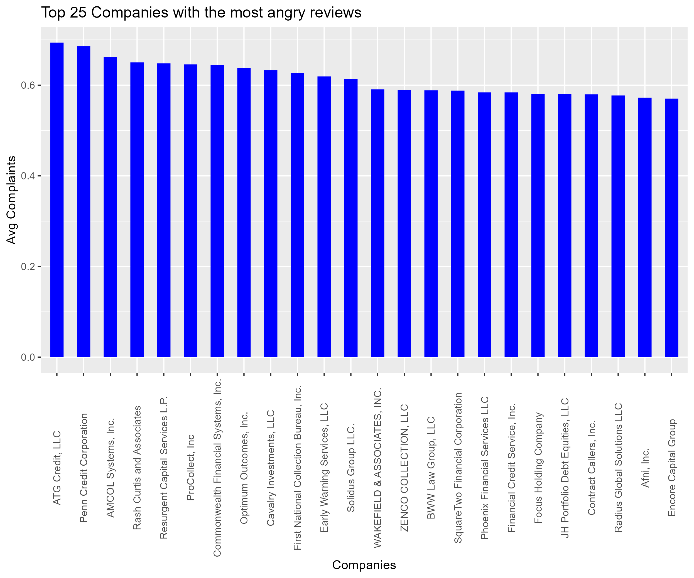

# Consumer Complaints

## Introduction

In this repo, we analyze the Consumer complaints that people have had about business and attempt to find trends about businesses through different sentiments people have made about said organizations. 

## Data Cleaning

There wasn't a lot needed to clean the data. However, to get it to a manageable size with relevant information, we only included those which had consumer narratives attached to them.

```
complaints <- consumers_complaints %>%
  filter(Consumer.complaint.narrative != '')
```

There is the possibility of filtering out the columns that I no longer need, however, it didn't appear to have much of a performance impact for me. 

Then, we need to get words to rows so we can do an inner join with sentiment analysis on them. As such, we use 

```
tidy_complaints <- complaints %>%
  filter(Consumer.complaint.narrative != '') %>%
  group_by(Complaint.ID) %>%
  mutate(
    chapter = cumsum(str_detect(Consumer.complaint.narrative, 
                                regex("^chapter [\\divxlc]", 
                                      ignore_case = TRUE)))) %>%
  ungroup() %>%
  unnest_tokens(word, Consumer.complaint.narrative) 
```

Now that the words are seperated, yet still groupped by complaint id, sentiment analysis can be done!

## Sentiment Analysis

### Top 25 Angriest Companies

The first question I want to answer is just which companies have the angriest reviews about a campany?

To do that, we group by the companies, do an innter join with nrc sentiment analysis, then summarize the amount, before picking the top 25 and arranging them descending. 

```
negative_complaints <- tidy_complaints %>%
  group_by(Company) %>%
  inner_join(nrc_angry) %>%
  summarise(count = n_distinct(Complaint.ID)) %>%
  top_n(24) %>%
  arrange(desc(count))
```


### Top 25 Companies customers are most angry about

However, that's just "angry", but we can use bing to determine *how* angry people are.

To do this, we use bing, which get's us a negative and positive value. We then find the total, and then the average for the company.

We then filter it down to companies with at least 250 words, then use the top 25 companies.  

```
average_sentiment <- tidy_complaints %>%
  inner_join(get_sentiments("bing")) %>%
  group_by(Company) %>%
  summarise(positive = sum(sentiment == "positive", na.rm = TRUE),
            negative = sum(sentiment == "negative", na.rm = TRUE),
            total = n()) %>%
  mutate(average_sentiment_score = (negative - positive) / total) %>%
  filter(total > 250) %>%
  top_n(24) %>%
  arrange(desc(average_sentiment_score))
```



### Word Bubble

Creating a word bubbles will allow us to see what customers are most angry about. Is it debts? Withdraws?

To do this, we first create a small filter to get rid of some common words that could mean a lot. Money is just money and limited could be a company.

Then we count the words, capping it at 100 to ensure the letters don't get to small. 

```
custom_stop_words <- bind_rows(tibble(word = c("money"),  
                                      lexicon = c("limited")), 
                               stop_words)

tidy_complaints %>%
  anti_join(custom_stop_words) %>%
  inner_join(nrc_angry) %>%
  count(word) %>%
  with(wordcloud(word, n, max.words = 100))
```


## Conclusion

From all of this, it's clear there are some companies that people are pretty mad at, and it's likely this is some of the ways that the government finds which businesses to go after. 

This also helps consumers understand the businesses that they may think about buying from. If there was a ranking of worse companies, well, it's pretty unlikely someone will buy from that companies if they are on said list. 

The word bubble is also important, as it helps understand the most common complaints (albiet there are far better ways to share that information)


